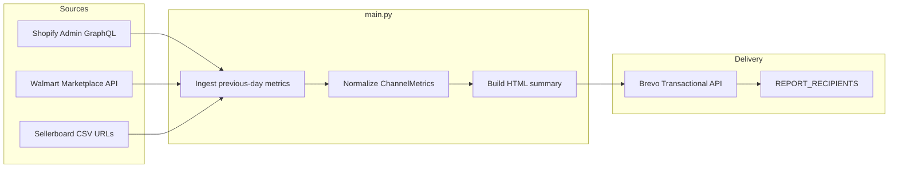

# Daily Revenue by Sales Platform

Automated previous-day revenue reporting across **Shopify**, **Walmart Marketplace**, and **Sellerboard**, with HTML delivery through **Brevo**.

The GitHub Actions workflow runs daily at **08:00 UTC** (`0 8 * * *`) and can also be triggered manually via `workflow_dispatch`.

---

## Project Architecture & Stats

| Integration | Mechanism | Auth | Refresh / window | Rate limits & notes |
|---|---|---|---|---|
| **Shopify** | Admin GraphQL (`orders` query, paginated) | Private app / Admin API access token (`X-Shopify-Access-Token`) | Previous calendar day in `America/New_York` | REST/GraphQL bucketed limits (~2 req/s standard, higher on Plus). Pipeline pages at 100 orders/request and retries `429`/`5xx`. |
| **Walmart** | Marketplace Orders API `GET /v3/orders` after OAuth token | OAuth2 client credentials (`WALMART_CLIENT_ID` / `WALMART_CLIENT_SECRET`) | Previous calendar day in `America/New_York` (UTC query bounds) | Token endpoint + order list; status × fulfillment matrix (Created/Acknowledged/Shipped/Delivered × SellerFulfilled/WFSFulfilled), then dedupe. Retries transient HTTP errors. |
| **Sellerboard** | Permanent automation CSV endpoints (`GET`) | Token embedded in permanent export URL | Daily + product CSV exports; filter to report date when a date column exists | No formal public rate limit for automation links. URLs must be **permanent** automation links (not one-off signed downloads). |
| **Brevo** | Transactional Email API `POST /v3/smtp/email` | API key header (`api-key`) | On each successful pipeline run | Account-tier SMTP quotas. Sender address must be verified in Brevo. |

**Report window:** all channels use the previous `America/New_York` calendar day (00:00 inclusive → next day 00:00 exclusive).

**Failure model:** each ingestion path is isolated. A failed channel is logged, marked **Unavailable** in the email, and does not block Brevo dispatch for the remaining metrics.

---

## Data Flow Architecture



---

## Roadblocks & Technical Considerations

| Risk | Detail | Mitigation |
|---|---|---|
| **Sellerboard URL expiry** | One-click / temporary export links return HTML login pages instead of CSV. | Store only **permanent automation** URLs (`SELLERBOARD_DAILY_URL`, `SELLERBOARD_PRODUCT_URL`). Pipeline detects HTML responses and marks Sellerboard Unavailable. |
| **Sellerboard schema drift** | Column names vary by export template (Sales vs Revenue vs Ordered Product Sales). | Flexible column matching + product-export fallback when daily sales columns are missing. |
| **Shopify rate limits / large order volumes** | Burst traffic or high order counts can hit leaky-bucket limits. | Cursor pagination (100/page), exponential backoff on `429`/`5xx`, GraphQL over chatty REST list loops. |
| **Walmart status fragmentation** | Orders API filters by a single `status` and `shipNodeType` per call. | Query the full status × fulfillment matrix, then deduplicate by purchase/customer order id before summing PRODUCT + SHIPPING charges. |
| **Partial API failures** | One vendor outage should not suppress the whole daily brief. | Per-channel `safe_fetch`: log exception, emit Unavailable row, still email successful channels. Exit code `2` only if **all** channels fail (email still attempted). |
| **Timezone alignment** | Shopify shop TZ, Walmart ET practice, Sellerboard export TZ can disagree. | Standardize the report day on `America/New_York` for all three ingest paths. |
| **Brevo sender verification** | Unverified `from` addresses are rejected. | Set `BREVO_SENDER_EMAIL` to a verified domain address. If unset, the pipeline falls back to the first recipient and logs a warning. |

---

## Environment Configuration

Configure these as **GitHub Actions secrets** (Settings → Secrets and variables → Actions). Locally, mirror them in a `.env` file at the repo root.

| Secret | Required | Format / example | Purpose |
|---|---|---|---|
| `SHOPIFY_ACCESS_TOKEN` | Yes | `shpat_…` | Shopify Admin API access token |
| `SHOPIFY_STORE_URL` | Yes | `your-store.myshopify.com` (with or without `https://`) | Shop hostname for Admin API |
| `WALMART_CLIENT_ID` | Yes | Walmart Marketplace client id string | OAuth client id |
| `WALMART_CLIENT_SECRET` | Yes | Walmart Marketplace client secret | OAuth client secret |
| `SELLERBOARD_DAILY_URL` | Yes | `https://app.sellerboard.com/...` permanent CSV automation URL | Daily dashboard/sales CSV |
| `SELLERBOARD_PRODUCT_URL` | Yes | Permanent CSV automation URL | Product-level CSV (fallback / enrichment) |
| `BREVO_API_KEY` | Yes | `xkeysib-…` | Brevo transactional API key |
| `REPORT_RECIPIENTS` | Yes | `ops@example.com,finance@example.com` (comma or semicolon separated) | Email recipients |
| `BREVO_SENDER_EMAIL` | Recommended | Verified sender, e.g. `reports@yourdomain.com` | Brevo `from` address |
| `BREVO_SENDER_NAME` | Optional | `Daily Revenue Report` | Brevo `from` display name |

The workflow maps each secret directly into the job environment (see `.github/workflows/daily_report.yml`).

---

## Local Development & Testing

### 1. Clone and install

```bash
cd Daily-revenue-by-sales-platform
python -m venv .venv
source .venv/bin/activate   # Windows: .venv\Scripts\activate
pip install -r requirements.txt
```

### 2. Create `.env`

```bash
cp .env.example .env   # or create manually
```

Example `.env`:

```env
SHOPIFY_ACCESS_TOKEN=shpat_xxx
SHOPIFY_STORE_URL=your-store.myshopify.com
WALMART_CLIENT_ID=xxx
WALMART_CLIENT_SECRET=xxx
SELLERBOARD_DAILY_URL=https://app.sellerboard.com/en/automation/reports/?...
SELLERBOARD_PRODUCT_URL=https://app.sellerboard.com/en/automation/reports/?...
BREVO_API_KEY=xkeysib-xxx
REPORT_RECIPIENTS=you@example.com
BREVO_SENDER_EMAIL=reports@yourdomain.com
BREVO_SENDER_NAME=Daily Revenue Report
```

> Never commit `.env`. It is ignored via `.gitignore`.

### 3. Run the pipeline

```bash
python main.py
```

`python-dotenv` loads `.env` automatically. The script:

1. Resolves yesterday in `America/New_York`
2. Ingests Shopify / Walmart / Sellerboard independently
3. Builds an HTML summary
4. Sends via Brevo

### Exit codes

| Code | Meaning |
|---|---|
| `0` | Email sent; at least one channel succeeded |
| `1` | Brevo dispatch failed |
| `2` | Email sent (or attempted path completed) but every channel was Unavailable |

### Manual GitHub run

Actions → **Daily Revenue Report Pipeline** → **Run workflow**.

---

## Repository layout

```
├── main.py                          # Orchestrator: ingest → aggregate → Brevo
├── requirements.txt                 # Pinned production dependencies
├── README.md
├── scripts/fetch_walmart_sales.py   # Standalone Walmart summary writer (optional relay)
├── data/walmart_daily_summary.json  # Artifact from the Walmart relay workflow
└── .github/workflows/
    ├── daily_report.yml             # Multi-platform daily email pipeline
    └── walmart_ingest.yml           # Optional Walmart JSON refresh job
```
