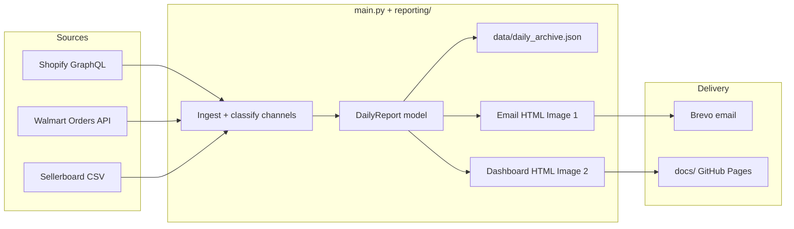

# Daily Revenue by Sales Platform

Automated previous-day revenue reporting across **Amazon (Sellerboard)**, **Shopify Direct**, **DICK'S SPORTING GOODS**, **Nordstrom**, and **Walmart**, with:

1. A plain-text-style **Brevo HTML email** (Image 1 layout)
2. A hosted **WEATHERMAN Daily Revenue Dashboard** under `docs/` (Image 2 layout)

The GitHub Actions workflow runs daily at **12:00 UTC** (`0 12 * * *`) and can also be triggered via `workflow_dispatch` (`target_date`, `backfill`, `force_backfill`, `send_email`).

Hosted dashboard: https://mg22mex.github.io/Daily-revenue-by-sales-platform/

---

## Project Architecture & Stats

| Integration | Mechanism | Auth | Refresh / window | Rate limits & notes |
|---|---|---|---|---|
| **Shopify** | Admin GraphQL `orders` (+ line items, tags, channel info) | Admin API token | Target day `America/New_York` | Split into Shopify Direct / DSG / Nordstrom via tags + channel name. Post-filters `createdAt` to the ET calendar day; excludes draft/POS/void/cancelled. Retries `429`/`5xx`. |
| **Walmart** | Marketplace Orders API after OAuth | Client credentials | Target day ET | Status × fulfillment matrix, then dedupe. Category + SKU rollups included. |
| **Sellerboard** | Permanent automation CSV `GET` | Token in URL | Daily + product exports | Daily CSV → Amazon revenue / units / Real ACOS. **Product (Dashboard by Product) CSV** → Amazon SKU drilldown + category matrix. Dates default to **DD/MM** (EU). |
| **Brevo** | `POST /v3/smtp/email` | API key | Each successful run | Subject: `Daily revenue by sales platform — YYYY-MM-DD`. CTA links to hosted dashboard. |

**Failure model:** each source is isolated. Failed channels render as `Unavailable` in the email and dashboard without blocking Brevo for the rest.

---

## Data Flow Architecture



---

## Report outputs

### Email (Image 1)
- Greeting (`Hi Rick,`) + long-form target date
- Revenue by sales platform (5 channels + Total)
- Category unit totals
- Ad metrics (Amazon Real ACOS, Shopify blended COS, revenue per ad dollar)
- Blue CTA `#1A73E8` → hosted dashboard URL

### Dashboard (Image 2)
Written to:
- `docs/index.html` (latest)
- `docs/YYYY-MM-DD.html` (dated snapshot)
- `docs/email-YYYY-MM-DD.html` (email preview for QA)

Sections: navy WEATHERMAN header, period overview cards, platform performance, ad/reconciliation cards, **category units by platform** (including Amazon), and **SKU drilldown · five channels**.

There is **no** green status banner on the dashboard; operational notes stay in logs / email only.

Enable **GitHub Pages** from the `docs/` folder on `main`, then set secret `DASHBOARD_PUBLIC_URL` to the Pages base URL (no trailing file name), e.g. `https://mg22mex.github.io/Daily-revenue-by-sales-platform`.

---

## Sellerboard (Amazon) details

| Concern | Behavior |
|---|---|
| Daily totals | `SELLERBOARD_DAILY_URL` — exact calendar-day match only (never sums a multi-day export) |
| SKU + categories | `SELLERBOARD_PRODUCT_URL` — prefer **Dashboard by Product** (Date + SKU/ASIN + Units + Sales). Rows for `target_date` feed Amazon column in category matrix and Amazon lines in SKU drilldown |
| Date locale | Numeric dates default to **DD/MM/YYYY** (`11/09/2026` = 11 Sep). Day-first is auto-detected when any day component is `> 12`; override with `SELLERBOARD_DAYFIRST` |
| Day-scoped snapshot | If a CSV has **no** date column, it is treated as a same-day automation snapshot for `target_date` |
| Archive merge | If a live parse returns Amazon `$0` but a prior archive day had revenue, the prior channel total is preserved so MTD/forecast stay continuous |

---

## Roadblocks & Technical Considerations

| Risk | Mitigation |
|---|---|
| Sellerboard temporary URLs return HTML | Use permanent automation links only; HTML responses mark Amazon Unavailable |
| Sellerboard DD/MM vs MM/DD | Default DMY + day-first detection; set `SELLERBOARD_DAYFIRST=us` only for US-formatted exports |
| Amazon KPI without SKUs | Ensure product URL is itemized (Dashboard by Product / Orders), not daily aggregate-only |
| Shopify channel misclassification | Tags / `sourceName` / channel definition; Nordstrom + DSG keywords; remainder → Shopify Direct |
| Shopify Direct inflation | Date-only query tokens + ET calendar-day post-filter; exclude draft/POS/void/cancelled |
| Shopify ad spend not in Admin API | `SHOPIFY_AD_SPEND`, or dated JSON/CSV (`data/shopify_ad_spend.json`) |
| Partial API failures | Per-source try/except; email/dashboard still publish |
| MTD / forecast / last month | Rolling `data/daily_archive.json`; optional `--backfill` + validated Aug/Sep baseline seed |

---

## Environment Configuration

| Secret / env | Required | Purpose |
|---|---|---|
| `SHOPIFY_ACCESS_TOKEN` | Yes | Admin API token |
| `SHOPIFY_STORE_URL` | Yes | `your-store.myshopify.com` |
| `WALMART_CLIENT_ID` / `WALMART_CLIENT_SECRET` | Yes | Marketplace OAuth |
| `SELLERBOARD_DAILY_URL` / `SELLERBOARD_PRODUCT_URL` | Yes | Permanent CSV automation URLs (daily + product) |
| `SELLERBOARD_DAYFIRST` | Optional | `true`/`dmy` (default) or `us`/`0` for MM/DD exports |
| `BREVO_API_KEY` | Yes | Transactional email |
| `REPORT_RECIPIENTS` | Yes | Comma/semicolon emails |
| `BREVO_SENDER_EMAIL` | Recommended | Verified Brevo sender |
| `BREVO_SENDER_NAME` | Optional | Default `Weatherman Revenue` |
| `DASHBOARD_PUBLIC_URL` | Recommended | GitHub Pages base URL for CTA |
| `SHOPIFY_AD_SPEND` | Optional | Day’s Shopify ad spend (USD) |
| `SHOPIFY_ADS_JSON_PATH` / `SHOPIFY_ADS_CSV_*` | Optional | Dated ad-spend feeds |
| `REPORT_GREETING_NAME` | Optional | Default `Rick` |
| `REPORT_DATE` | Optional | Same as `--date YYYY-MM-DD` |
| `SKIP_EMAIL` | Optional | `1`/`true` skips Brevo |

---

## Local Development & Testing

```bash
cd Daily-revenue-by-sales-platform
python -m venv .venv
source .venv/bin/activate
pip install -r requirements.txt
cp .env.example .env   # fill secrets
```

**UI-only demo** (no APIs / no Brevo) — renders Image 1/2 sample (classic Sep 10 mockup, or synthetic SKUs/categories for other dates):

```bash
python main.py --demo
python main.py --date 2026-09-11 --demo --skip-email
# open docs/index.html and docs/email-*.html
```

Without API secrets, `python main.py --date …` **auto-falls back to demo** so local verification still produces dashboard artifacts.

**Targeted / live run:**

```bash
python main.py --date 2026-09-11 --skip-email
python main.py --backfill --date 2026-09-10 --skip-email
python main.py --backfill --force --no-seed-baseline --skip-email
```

---

## Repository layout

```
├── main.py                         # Ingestion + orchestration
├── reporting/
│   ├── models.py                   # DailyReport data model
│   ├── categories.py               # SKU → category mapping
│   ├── email_report.py             # Image 1 Brevo HTML
│   └── dashboard.py                # Image 2 hosted dashboard HTML
├── docs/                           # Generated dashboard (GitHub Pages)
├── data/
│   ├── daily_archive.json          # MTD / last-month rollup archive
│   └── shopify_ad_spend.json       # Optional dated Shopify ad spend
├── scripts/
│   ├── fetch_walmart_sales.py
│   └── backfill_archive.py
└── .github/workflows/daily_report.yml
```
