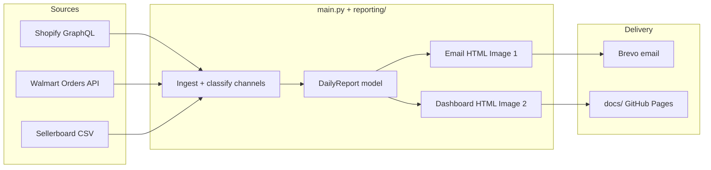

# Daily Revenue by Sales Platform

Automated previous-day revenue reporting across **Amazon (Sellerboard)**, **Shopify Direct**, **DICK'S SPORTING GOODS**, **Nordstrom**, and **Walmart**, with:

1. A plain-text-style **Brevo HTML email** (Image 1 layout)
2. A hosted **WEATHERMAN Daily Revenue Dashboard** under `docs/` (Image 2 layout)

The GitHub Actions workflow runs daily at **08:00 UTC** (`0 8 * * *`) and can also be triggered via `workflow_dispatch`.

---

## Project Architecture & Stats

| Integration | Mechanism | Auth | Refresh / window | Rate limits & notes |
|---|---|---|---|---|
| **Shopify** | Admin GraphQL `orders` (+ line items, tags, channel info) | Admin API token | Previous day `America/New_York` | Split into Shopify Direct / DSG / Nordstrom via tags + channel name. Retries `429`/`5xx`. |
| **Walmart** | Marketplace Orders API after OAuth | Client credentials | Previous day ET | Status × fulfillment matrix, then dedupe. Category + SKU rollups included. |
| **Sellerboard** | Permanent automation CSV `GET` | Token in URL | Daily + product exports | Powers **Amazon** revenue, units, Real ACOS, and Amazon SKU rows. |
| **Brevo** | `POST /v3/smtp/email` | API key | Each successful run | Subject: `Daily revenue by sales platform — YYYY-MM-DD`. CTA links to hosted dashboard. |

**Failure model:** each source is isolated. Failed channels render as `Unavailable` in the email and dashboard status, without blocking Brevo for the rest.

---

## Data Flow Architecture



---

## Report outputs

### Email (Image 1)
- Greeting (`Hi Rick,`) + long-form yesterday date
- Revenue by sales platform (5 channels + Total)
- Category unit totals
- Ad metrics (Amazon Real ACOS, Shopify blended COS, revenue per ad dollar)
- Blue CTA `#1A73E8` → hosted dashboard URL

### Dashboard (Image 2)
Written to:
- `docs/index.html` (latest)
- `docs/YYYY-MM-DD.html` (dated snapshot)
- `docs/email-YYYY-MM-DD.html` (email preview for QA)

Sections: navy WEATHERMAN header, green status bar, period overview cards, platform performance, ad/reconciliation cards, category tables, SKU drilldown.

Enable **GitHub Pages** from the `docs/` folder on `main`, then set secret `DASHBOARD_PUBLIC_URL` to the Pages base URL (no trailing file name), e.g. `https://<user>.github.io/Daily-revenue-by-sales-platform`.

---

## Roadblocks & Technical Considerations

| Risk | Mitigation |
|---|---|
| Sellerboard temporary URLs return HTML | Use permanent automation links only; HTML responses mark Amazon Unavailable |
| Shopify channel misclassification | Tags / `sourceName` / channel definition; Nordstrom + DSG keywords; remainder → Shopify Direct |
| Shopify ad spend not in Admin API | Optional secret `SHOPIFY_AD_SPEND` (daily). Blended COS + revenue/ad dollar derive from Direct+DSG+Nordstrom revenue |
| Partial API failures | Per-source try/except; email/dashboard still publish |
| MTD / forecast / last month | Rolling `data/daily_archive.json` updated each run; forecast = MTD ÷ day × days-in-month |

---

## Environment Configuration

| Secret | Required | Purpose |
|---|---|---|
| `SHOPIFY_ACCESS_TOKEN` | Yes | Admin API token |
| `SHOPIFY_STORE_URL` | Yes | `your-store.myshopify.com` |
| `WALMART_CLIENT_ID` / `WALMART_CLIENT_SECRET` | Yes | Marketplace OAuth |
| `SELLERBOARD_DAILY_URL` / `SELLERBOARD_PRODUCT_URL` | Yes | Permanent CSV automation URLs |
| `BREVO_API_KEY` | Yes | Transactional email |
| `REPORT_RECIPIENTS` | Yes | Comma/semicolon emails |
| `BREVO_SENDER_EMAIL` | Recommended | Verified Brevo sender |
| `BREVO_SENDER_NAME` | Optional | Default `Daily Revenue Report` |
| `DASHBOARD_PUBLIC_URL` | Recommended | GitHub Pages base URL for CTA |
| `SHOPIFY_AD_SPEND` | Optional | Yesterday’s Shopify ad spend (USD) |
| `REPORT_GREETING_NAME` | Optional | Default `Rick` |

---

## Local Development & Testing

```bash
cd Daily-revenue-by-sales-platform
python -m venv .venv
source .venv/bin/activate
pip install -r requirements.txt
cp .env.example .env   # fill secrets
```

**UI-only demo** (no APIs / no Brevo) — renders the Image 1/2 sample:

```bash
python main.py --demo
# open docs/index.html and docs/email-*.html
```

**Full run locally:**

```bash
python main.py
# or artifacts only:
python main.py --skip-email
```

---

## Repository layout

```
├── main.py                     # Ingestion + orchestration
├── reporting/
│   ├── models.py               # DailyReport data model
│   ├── categories.py           # SKU → category mapping
│   ├── email_report.py         # Image 1 Brevo HTML
│   └── dashboard.py            # Image 2 hosted dashboard HTML
├── docs/                       # Generated dashboard (GitHub Pages)
├── data/daily_archive.json     # MTD / last-month rollup archive
├── scripts/fetch_walmart_sales.py
└── .github/workflows/daily_report.yml
```
